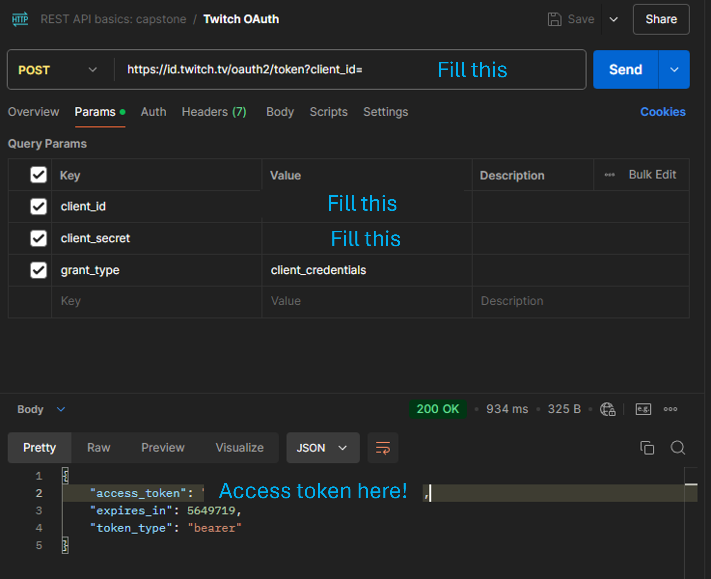
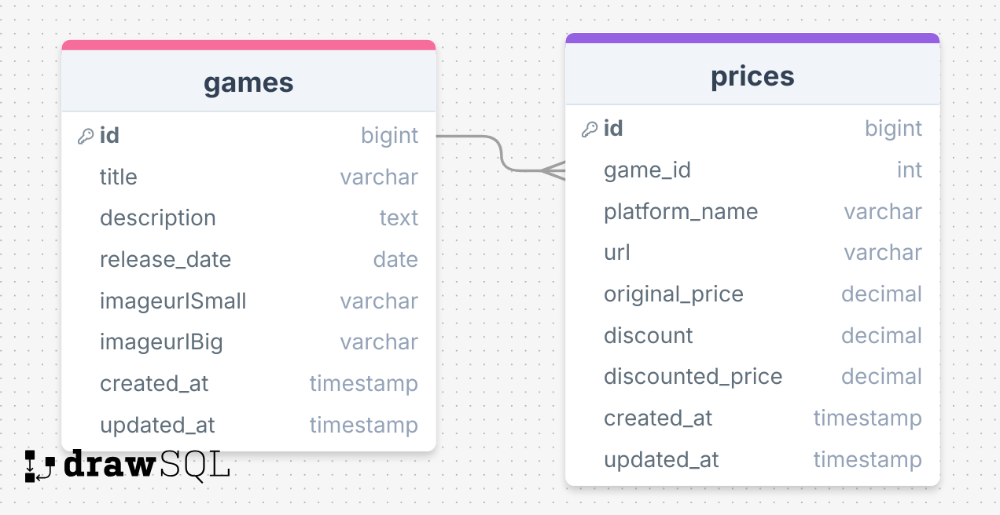

# My Capstone

## Setup

1. Clone the repository: `git clone <repo-link>`

```
`git clone https://github.com/Michelle-Watson/capstone-michelle.git`
```

### Setup Server

1. `cd .\server\`
2. Install dependencies: `npm install`
3. Set environment variables in a `.env` file. See example below:

```
PORT=5050
DB_HOST=127.0.0.1
DB_NAME=capstone
DB_USER=root
DB_PASSWORD=rootroot
TWITCH_CLIENT_ID=
TWITCH_CLIENT_SECRET=
ACCESS_TOKEN=
```

- `ACCESS_TOKEN` will be generated upon requests to the server
- Notice that there's `DB_` environmental variables. This means that you need a database (DB for short) running on your local machine. If you would like support on setting up your local database, see '[how to set up a local database](#how-do-i-setup-a-local-database)' in [extra support](#extra-support) at the bottom.

4. Configure database

- Create a local database named `capstone` (or however you have named it in your server side .env file)
- Run migration (setup tables in your local database) and seeds (adds data to your newly created tables)

```
npm run migrate
npm run seed
```

- ASIDE: If you've used `knex` and this looks unfamiliar, it's because I wrote shorthand scripts in the `package.json` file located [here](https://github.com/Michelle-Watson/capstone-michelle/blob/main/server/package.json). For clarity:
- `npm run migrate` = `npx knex migrate:latest`
- `npm run seed` = `npx knex seed:run`

5. Configure IGDB API

- Sign up for IGDB API (https://api-docs.igdb.com/#getting-started)
- Create an application with the following settings
  - OAuth Redirect URLs: http://localhost
  - Category: Website Integration
  - Client Type: Confidential
  - Generate Client Secret
- Using your Client ID and Client Secret, make a POST request to the endpoint below to obtain an access token
  - https://id.twitch.tv/oauth2/token?client_id=YOUR_CLIENT_ID&client_secret=YOUR_CLIENT_SECRET&grant_type=client_credentials
- Add your Client ID and Access Token to the .env file as outlined in the example .env files
- **ASIDE**: I personally had issues with this step, so feel free to fork my public Postman collection (see REST API basics: capstone) and replace my values with yours to get your own access token
  - Specifically: see ['POST: Twitch OAuth'](https://www.postman.com/aerospace-architect-73612045/api-practice)

<!--  -->

<div style="text-align: center;">
  
</div>

#### Run Server

- Start the server: `npm start`
- Access the server at: `http://localhost:5050`
  - The PORT will be whatever you send in the `.env` file. The example set `PORT=5050`, so you will access the server on that port as well

### Setup Client

1. `cd .\game-finder\`
2. Install dependencies: `npm install`
3. Set environment variables in a `.env` file.

```
VITE_API_URL=http://localhost:5050
```

#### Run Client

- Start the server: `npm run dev`
- Access the app at: `http://localhost:5050`

#### Next Steps

- 🤳🏾 Filters
  - home page fetches a list of games from my personal db, as well as a list of 10 unique games sorted by rating. I’d like to add filters so that the fetched list of games from the API, will be based on the users preference.
- 📉 Real Price Data
  - IGDB API doesn’t have price data
  - no APIs to fetch price data for a specific PC game
  - PLAN: incorporate live price data using unofficial APIs or web scraping
  - EXAMPLE: If users add a link to the steam store page, then I will have a job that scrapes that page for the update price
- 🔒 User Registration & Login
  - Allow users to create accounts to save their starred games
- 🌟 Game Recommendations
  - Suggest titles based on a user’s starred games.
- 🔔 Price Notifications
  - Notify users when starred games have a price drop

## Overview

###### Brief description

GameDeal Finder is an application that helps users find the best deals on video games across multiple platforms. Users can search for a specific video game title, view its price on supported platforms, and be directed to the store page to make a purchase. Initially, the app will focus on Steam, with the potential to add other gaming platforms in the future.

### Problem Space

###### Why this app is needed. Background information and pain points.

Video game prices can vary significantly between different digital storefronts, and it can be time-consuming for users to check multiple sites to find the best deal. Many gamers end up missing out on sales or discounts because they don't have an easy way to compare prices across platforms. GameDeal Finder solves this problem by providing a simple, user-friendly interface that aggregates video game prices from different platforms, helping users make informed purchasing decisions and saving them money.

### User Profile

###### Who this app is meant for and how they'll use it.

🎯 Gamers:

- Looking for the best prices for PC video games before purchasing.
- Interested in sales, discounts, or price drops for their favorite titles
- Want a simple, fast way to compare prices without visiting multiple sites.

### Features as User Stories

- 🔍 As a user, I want to see a list of video games with their title.
- 🏪 As a user, I want to click on a link that takes me directly to the store page where I can purchase the game.
- 🖥️ As a user, I want to see a list of platforms and their current price for a specific game.
- 🤑 As a user, I want to see the game’s current price, regular price, and any discounts applied (if available).
- 🎮 As a user, I want the app to display the platform’s logo (e.g., Steam, GOG) alongside the price for easy identification.

## Implementation

### Tech Stack

- **Front-end:** React, Sass, Axios, React Router
- **Back-end:** Node.js, Express.js
- **Database:** MySQL, Knex
- **Authentication _(optional future enhancement)_:** Firebase, bcrypt for password hashing, Twitch OAuth

### APIs

- IGDB API (https://www.igdb.com/api)

### Sitemap

###### Pages of my app with brief descriptions

- Home page
- Game Detail Page
- Add/Edit Game
- Add/Edit Price

### Screenshots

###### Wireframes of my app's screens

#### Home page (List Games page)

<div style="text-align: center;">
  
</div>
- Display a list of games with cover art, title, release date and description

<div style="text-align: center;">
  
</div>
- Search bar to filter list of games
- EXAMPLE: If user types 'rpg', all games with rpg in the title or description will be shown

#### Game Detail Page

<div style="text-align: center;">
  
</div>

- Show detailed information about the game (e.g., description, release date).
- In a table below, list prices from supported platforms, with links to buy on each platform.
- Display the original price on the platform, and the discounted price on the platform.
- Steep discount (>60%) will be highlighted
- The lowest price will be at the top of the list

#### ADMIN: Add/Edit Game Page

<div style="text-align: center;">
  
</div>

<div style="text-align: center;">
  
</div>

- Allow admin user to add/edit a game from the game database

#### Game Detail Page

<div style="text-align: center;">
  
</div>

<div style="text-align: center;">
  
</div>

- Allow admin user to add/edit a price from the price database

### Data

###### Data and the relationships between the data points.



### Endpoints

###### Endpoints of my server including HTTP methods, parameters, and example responses.

You can view all my endpoints on my publiclly available Postman Collection here (see REST API basics: capstone): https://www.postman.com/aerospace-architect-73612045/api-practice

**GET /games**

- fetch a list of all games, with basic details like title, description, and release date.
- Platform-specific prices not available here, just the general game data

Parameters:

- title: Name of the video game
  - Future feature allows for users to make a search query

Response:

```
[
    {
        "id": 1,
        "title": "Cyberpunk 2077",
        "description": "Cyberpunk 2077 is an open-world, action-adventure RPG set in the dark future of Night City — a dangerous megalopolis obsessed with power, glamor, and ceaseless body modification.",
        "release_date": "2020-12-10T05:00:00.000Z",
        "imageurlSmall": "https://shared.cloudflare.steamstatic.com/store_item_assets/steam/apps/1091500/capsule_231x87.jpg?t=1732384908",
        "imageurlBig": "https://shared.cloudflare.steamstatic.com/store_item_assets/steam/apps/1091500/header.jpg?t=1732384908",
    },
...
]
```

**POST /games**

- User can add a game to the database

Parameters:

- title: Name of the video game
- description: Description oof the game
- release_date: The release date of the game

Response:

```

{
    "id": 2,
    "title": "The Witcher 3: Wild Hunt",
    "description": "An open-world RPG. You are Geralt of Rivia, mercenary monster slayer. Before you stands a war-torn, monster-infested continent you can explore at will. Your current contract? Tracking down Ciri — the Child of Prophecy, a living weapon that can alter the shape of the world.",
    "release_date": "2015-05-19T04:00:00.000Z",
    "imageurlSmall": "https://shared.cloudflare.steamstatic.com/store_item_assets/steam/apps/292030/capsule_231x87.jpg?t=1730212929",
    "imageurlBig": "https://shared.cloudflare.steamstatic.com/store_item_assets/steam/apps/292030/header.jpg?t=1730212929",
}

```

**GET /games/:id**

- returns detailed information for a specific game, including its title, description and release date.

Parameters:

- id: game id

Response (example: `/games/1`):

```

{
    "id": 1,
    "title": "Cyberpunk 2077",
    "description": "Cyberpunk 2077 is an open-world, action-adventure RPG set in the dark future of Night City — a dangerous megalopolis obsessed with power, glamor, and ceaseless body modification.",
    "release_date": "2020-12-10T05:00:00.000Z",
    "imageurlSmall": "https://shared.cloudflare.steamstatic.com/store_item_assets/steam/apps/1091500/capsule_231x87.jpg?t=1732384908",
    "imageurlBig": "https://shared.cloudflare.steamstatic.com/store_item_assets/steam/apps/1091500/header.jpg?t=1732384908",
}

```

**PUT /games/:id**

- User can update an existing game in the database

Parameters:

- title: Name of the video game
- description: Description oof the game
- release_date: The release date of the game

Response (example: `/games/1`):

```

{
    "id": 1,
    "title": "Cyberpunk 2077",
    "description": "Cyberpunk 2077 is an EPIC open-world, action-adventure RPG set in the dark future of Night City — a dangerous megalopolis obsessed with power, glamor, and ceaseless body modification.",
    "release_date": "2020-12-10T05:00:00.000Z",
    "imageurlSmall": "https://shared.cloudflare.steamstatic.com/store_item_assets/steam/apps/1091500/capsule_231x87.jpg?t=1732384908",
    "imageurlBig": "https://shared.cloudflare.steamstatic.com/store_item_assets/steam/apps/1091500/header.jpg?t=1732384908",
}

```

**GET /games/:id/prices**

- fetches the prices for a specific game from multiple platforms.

Parameters:

- id: game id as number

Response (example: `/games/1/prices`):

```
[
    {
        "id": 1,
        "game_id": 1,
        "platform_name": "Steam",
        "original_price": 59.99,
        "discount": 0.2,
        "discounted_price": 47.99,
        "url": "https://store.steampowered.com/app/1091500"
    },
    {
        "id": 2,
        "game_id": 1,
        "platform_name": "GOG",
        "original_price": 59.99,
        "discount": 0.1,
        "discounted_price": 53.99,
        "url": "https://www.gog.com/game/cyberpunk_2077"
    },
    ...
]
```

**GET /prices**

- fetch a list of all prices across all platforms for all games

Response:

```
[
    {
        "id": 1,
        "game_id": 1,
        "platform_name": "Steam",
        "original_price": 59.99,
        "discount": 0.2,
        "discounted_price": 47.99,
        "url": "https://store.steampowered.com/app/1091500"
    },

    {
        "id": 2,
        "platform_name": "GOG",
        "original_price": 59.99,
        "discount": 0.1,
        "discounted_price": 53.99,
        "url": "https://www.gog.com/game/cyberpunk_2077"
    },
    ...
]

```

**POST /prices**

- Create a new price entry for the prices database

Parameters:

- game_id: Foreign key linking to the games table.
- platform_name: The platform where the game is available (e.g., Steam, GOG).
- url: URL to the store page where users can purchase the game.
- original_price: The original price of the game without any discount.
- discount: Discount percentage (if applicable).
- discounted_price: Price after the discount has been applied.

Response:

```
[
    {
        "id": 1,
        "game_id": 1,
        "platform_name": "Steam",
        "original_price": 59.99,
        "discount": 0.2,
        "discounted_price": 47.99,
        "url": "https://store.steampowered.com/app/1091500"
    },
    {
        "id": 2,
        "game_id": 1,
        "platform_name": "GOG",
        "original_price": 59.99,
        "discount": 0.1,
        "discounted_price": 53.99,
        "url": "https://www.gog.com/game/cyberpunk_2077"
    },
    ...
]
```

**PUT /prices/:id**

- Update price entry for the prices database

Parameters:

- game_id: Foreign key linking to the games table.
- platform_name: The platform where the game is available (e.g., Steam, GOG).
- url: URL to the store page where users can purchase the game.
- original_price: The original price of the game without any discount.
- discount: Discount percentage (if applicable).
- discounted_price: Price after the discount has been applied.

Response:

```
{
    "id": 1,
    "game_id": 1,
    "platform_name": "Steam",
    "original_price": 59.99,
    "discount": 0.2,
    "discounted_price": 47.99,
    "url": "https://store.steampowered.com/app/1091500"
}
```

## Roadmap

###### My project scoped as a sprint. Task breakdown.

- Create client

  - react project with routes and boilerplate pages

- Create server

  - express project with routing, with placeholder 200 responses

- Create migrations

- Gather 10 sample game and price data (10 games, each with at least 1 pricing on 2 platforms)

- Create seeds with sample game data

- Feature: List games on home page

  - Implement list games home page (header includes non-functional search bar)and table with list of games in games database (box art, title, description, price on the Steam platform)
  - Create GET `/games` endpoint

- Feature: View Game Details - Hero

  - Implement view game details page
  - Create GET `/games/:id`

- Feature: View Game Details - Table of Prices

  - Implement table of game prices from multiple platforms on the game details page. Table contains platform name, platform logo, URL to buy the game on that specific platform, and price on that platform
  - Create GET `/games/:id/prices`

- Feature: Hidden Admin Mode - Add/edit Games

  - Allow adding new games or editing existing games.
  - Create add or POST endpoint at `/games`, client side can access this from `/games/add`
  - Create edit or PUT endpoint `/games/:id`, client side can access this from `/games/:id/edit`
  - Hidden Form page (not meant to be pretty since) that can't be navigated to, but can be accessed by typing in the URL manually

- Feature: Hidden Admin Mode - Add/edit Prices

  - Allow adding new games or editing existing prices.
  - Create add or POST endpoint at `/prices`, client side can access this from `/prices/add`
  - Create edit or PUT endpoint at `/prices/:id`, client side can access this from `/prices/:id/edit`
    - Why is this the client side URL? So that the game_id is the same as the id from the URL? So that admin doesn't need to input it themselves. Send useParams in body request
  - Hidden Form page (not meant to be pretty since) that can't be navigated to, but can be accessed by typing in the URL manually

#### Contact Me! 🫱🏾‍🫲🏾

<p align="left">
<a href="https://www.linkedin.com/in/michelleawatson" target="_blank">
  
</a>
<a href="mailto:michellealiciawatson@gmail.com">
  
</a>
<a href="https://discord.com/users/234360551742898176">
  
</a>
  <a href="https://steamcommunity.com/id/maybuns/">
  
</a>
  </a>
  <a href="https://myanimelist.net/profile/xmaybunnyx">
  
</a>
</p>

## Extra Support

### How do I setup a local Database?

Here's a walkthrough of how to install MySQL. MySQL is an open-source and free relational database management system (RDBMS). We install MySQL server, which holds and manages the data, and a client, MySQL Workbench, which is what we will use to run our queries.

#### MySQL Install For Mac

<div class="markdown--TOg2r body--vb2Ya"><p>MySQL is an open-source and free relational database management system (RDBMS). We install MySQL server, which holds and manages the data, and a client, MySQL Workbench, which is what we will use to run our queries.</p>
<strong>Downloading and Running the MySQL Server and MySQL Workbench Installers</strong>
<p>There are very detailed instructions on the install process for Mac OSX for reference <a href="https://dev.mysql.com/doc/refman/8.0/en/macos-installation.html" target="_blank" rel="noopener noreferrer">here</a>, however please follow the instructions below to ensure a standard working environment.</p>
<p>For Mac OS, MySQL Server and MySQL Workbench must be installed separately, however the process is straightforward and easy for both.</p>
<strong>MySQL Server</strong>
<ol>
<li>Download the MySQL Server package for Mac OSX from here: https://dev.mysql.com/downloads/mysql/. Select the DMG package option (not TAR) and click on "No thanks, just start my download."</li>
</ol>
<ul>
<li>Under "Select OS Version", pick the version based on your computer's processor (Found in " &gt; About This Mac"):
<ul>
<li>If you have Intel Processor, pick "x86" option</li>
<li>If you have M Processor, pick "ARM" option</li>
</ul>
</li>
</ul>
<p>Please note that screenshots might show an earlier version of the installer, please select the latest version at the time for your installation.</p>
<ol start="2">
<li>Open the downloaded package and double-click the .pkg file to run:
<ol start="3">
<li>Click through the installation wizard:</li>
</ol>
<ol start="4">
<li>For Authentication select "<strong>Use Legacy Password Encryption</strong>" (this is to retain compatibility with other SQL clients).</li>
</ol>
<ol start="5">
<li>You will be asked to set up a password for the server. To make sure we always remember our password, we'll set it to "rootroot". After you have set your password, click Finish.</li>
</ol>
<p><em>Important: If you set you password to be anything else other than "rootroot", you <strong>must</strong> remember it because you will use it when trying to access data from the server later on. It's very hard to reset it later.</em></p>
<strong>MySQL Workbench</strong>
<p>On MacOS, MySQL Workbench must be installed separately from server.</p>
<ol>
<li>Download the Workbench from <a href="https://dev.mysql.com/downloads/workbench/" target="_blank" rel="noopener noreferrer">here</a></li>
</ol>
<ul>
<li>Similar to installing MySQL Server, make sure to select the right OS Version, based on your processor type.</li>
</ul>

<ol start="2">
<li>Open the package and drag the application into your 'Applications' folder:</li>
</ol>

<ol start="3">
<li>Start the application. You may wish to pin it to the dock after doing so.</li>
</ol>

<ol start="4">
<li>Create a new connection to your server with the details entered in the installation process:</li>
</ol>

<p>We can now host a database on our computer through the MySQL Server we have set up, and can execute queries against it through our client, MySQL Workbench!</p>
<p>We can also access information about our databases vs our server connection by clicking on the different tabs in the top left corner.</p>

<strong>Starting and Stopping the MySQL Server</strong>

<p>On Mac the SQL server runs as a background process and may be started and stopped from within its own area within System Preferences. Usually MySQL Server will run with as part of computer startup and continue to do so, but you may wish to stop it is a background process or restart it if there are server-related errors.</p>
<p>To start or stop the MySQL Server, open the settings panel:</p>

<strong>Optional: Command Line Tools for MySQL</strong>

<p>In order to access MySQL from the command line, you will need to update your PATH in a file called <code>.zshrc</code>.</p>
<ol>
<li>Open terminal and enter <code>touch ~/.zshrc &amp;&amp; open ~/.zshrc</code></li>
<li>Add the following line to the file:</li>
</ol>
<pre class="language-js"><code class="language-js"><span class="token keyword">export</span> <span class="token constant">PATH</span><span class="token operator">=</span>$<span class="token constant">PATH</span><span class="token operator">:</span><span class="token operator">/</span>usr<span class="token operator">/</span>local<span class="token operator">/</span>mysql<span class="token operator">/</span>bin
</code></pre>
<ol start="3">
<li>Save and close the file</li>
</ol>
<p>In a new terminal, you should now be able to run the command <code>mysql --version</code> and see the installed version of MySQL.</p>
<strong>Troubleshooting</strong>
<p>Cannot connect to the server, with the error: 'Unable to connect to host xxx, or the request timed out.':</p>
<ul>
<li>Double check you have your MySQL server running, and you have the correct IP address (127.0.0.1 or <em>localhost</em>) in the hostname box</li>
<li>Ensure that your port is set to the default 3306 in the connection information (this is the default)</li>
</ul>
<p>Cannot connect to the server, with the error: 'Unable to connect to host 127.0.0.1 because access was denied.'</p>
<ul>
<li>Double check your password is <code>rootroot</code></li>
</ul>
<p>No Results from your Query</p>
<ul>
<li>Have you loaded data into the correct database?</li>
<li>Is your query well formed, and expected to return results?</li>
</ul>
</div>

#### MySQL Install For Windows

<div class="markdown--TOg2r body--vb2Ya"><p>MySQL is an open-source and free relational database management system (RDBMS). We install MySQL server, which holds and manages the data, and a client, MySQL Workbench, which is what we will use to run our queries.</p>
<p>Everything that we will need can be installed through the MySQL installer. We will download the installer first and choose the elements of MySQL that we need.</p>

<p>There are very detailed instructions on the install for Windows process for reference <a href="https://dev.mysql.com/doc/refman/8.0/en/windows-installation.html" target="_blank" rel="noopener noreferrer">here</a>, however please follow the instructions below to ensure a standard working environment.</p>
<ol>
<li>For Windows, MySQL and most of its associated tooling is included in one bundled installer, which is available at https://dev.mysql.com/downloads/installer/. Please open this webpage and download the second MSI installer.</li>
</ol>
<ol start="2">
<li>Download it by clicking on "No thanks, just start my download".</li>
</ol>
<ol start="3">
<li>Save and run the downloaded file.</li>
</ol>
<ol start="4">
<li>When the installer is open, make sure to select the "Custom" Setup Type and click next.</li>
</ol>
<ol start="5">
<li>You will need to go through and select the latest versions of the following 3 things. If there are later versions of some of these components than what is in these instructions, select the latest one.</li>
</ol>
<ul>
<li>MySQL Server (from MySQL Servers)</li>
<li>MySQL Workbench (from Applications)</li>
<li>MySQL Shell (from Applications)</li>
</ul>
<ol start="6">
<li>After having selected all of them, click on Next.</li>
</ol>
<ol start="7">
<li>You are now in the <strong>Check Requirements</strong> section. In this section, the installer makes sure that it has everything it needs to install all selected products. <em>Note: If you do not see any requirements, it means that you already have everything you need and you can click on Next and move on to step 10.</em> In order to download what we need, click  <strong>Execute</strong> at the bottom (<strong>Not on "Next"</strong>). This will start a download of the Microsoft Visual C++ Redistributable.</li>
</ol>
<ol start="8">
<li>Once downloaded, close the small Microsoft Visual C++ window.</li>
</ol>

<ol start="9">
<li>Once everything has been satisfied, you should be able to see the "INSTL DONE" messages. You can now click on Next.</li>
</ol>

<ol start="10">
<li>Everything should be ready to install. Click on Execute to start the installation.</li>
</ol>

<ol start="11">
<li>When everything is complete, click on Next.</li>
</ol>

**Product Configuration**

<p>We now need to configure the MySQL server.</p>
<ol start="12">
<li>You should see the server in the Product Configuration List. Click on Next.</li>
</ol>

<ol start="13">
<li>Leave the default options for Type and Networking and click Next.</li>
</ol>

<ol start="14">
<li>For Authentication Method, choose <strong>Use Legacy Authentication Method</strong>. Click Next.</li>
</ol>

<ol start="15">
<li>You will be asked to set up a password for the server. To make sure we always remember our password, we'll set it to "rootroot". After you have set your password, click Next.</li>
</ol>
<p><em>Important: If you set you password to be anything else other than "rootroot", you <strong>must</strong> remember it because you will use it when trying to access data from the server later on. It's very hard to reset it later.</em></p>

<ol start="16">
<li>You can decide if you want the MySQL Server to start along with the System Startup, we decide to uncheck this option.</li>
</ol>

<ol start="17">
<li>You might get a screen asking for Server File Permissions, leave it to default selected option an click Next</li>
</ol>

<ol start="18">
<li>You are now ready to apply the configurations to the MySQL Server. Click on Execute. After it's complete, click on Finish.</li>
</ol>

<ol start="19">
<li>You have now configured all products. We can almost finalize the installation by clicking on Next.</li>
</ol>

<ol start="20">
<li>By clicking on Finish, we will launch MySQL Workbench (and MySQL Server in the background).</li>
</ol>

<ol start="21">
<li>You should be able to see MySQL Workbench open up. You should be able to see one MySQL Connection. Remember that MySQL Workbench is just our way to connect to a database, which will be stored on MySQL Server. This is why we have a MySQL connection to the local database server we just set up. Click on this connection.</li>
</ol>

<ol start="22">
<li>Once you click on the connection, you will be asked for the password for the local MySQL server that will hold our databases. This is the same password you set up earlier and should be "rootroot".</li>
</ol>

<ol start="23">
<li>You are in! In the left panel, you can see more information about the server we are connected to.</li>
</ol>

<ol start="24">
<li>If you click on Schemas, you should be able to see all of your databases, which is empty for now.</li>
</ol>

<p>We can now host a database on our computer through the MySQL Server we have set up, and can execute queries against it through our client, MySQL Workbench!</p>
 <strong>Starting and Stopping the MySQL Server through the MySQL Notifier</strong>
<p>While the MySQL Server process can be stopped or started as a Windows Service, it can be controlled more conveniently through the taskbar using MySQL Notifier. Download and run the latest installer from https://downloads.mysql.com/archives/notifier/</p>
<p>Once complete, you should have a new taskbar icon to easily start and stop the MySQL Server.</p>

<strong>Optional: Command Line Tools for MySQL</strong>

<p>In order to access MySQL from the command line, you will need to update a system variable called <strong>Path</strong>.</p>
<ol>
<li>Right click on the Windows <strong>Start Menu</strong> and select <strong>System</strong></li>
<li>Under "Related settings" click on <strong>Advanced system settings</strong></li>
<li>Under the "Advanced" tab click on <strong>Environment Variables</strong></li>
<li>Select <strong>Path</strong> and click <strong>Edit</strong></li>
<li>Click <strong>New</strong>, and add the following. Replace <strong>X.X</strong> with your version of MySQL, for example <strong>8.0</strong>:</li>
</ol>
<pre class="language-js"><code class="language-js"><span class="token constant">C</span><span class="token operator">:</span>\Program Files\MySQL\MySQL Server <span class="token constant">X</span><span class="token punctuation">.</span><span class="token constant">X</span>\bin
</code></pre>
<ol start="6">
<li>Click OK</li>
</ol>
<p>In your command line, you should now be able to run the command <code>mysql --version</code> and see the installed version of MySQL.</p>
<strong>Troubleshooting</strong>
<p>Cannot connect to the server, with the error: 'Unable to connect to host xxx, or the request timed out.':</p>
<ul>
<li>Double check you have your MySQL server running, and you have the correct IP address (127.0.0.1 or <em>localhost</em>) in the hostname box</li>
<li>Ensure that your port is set to the default 3306 in the connection information (this is the default)</li>
</ul>
<p>Cannot connect to the server, with the error: 'Unable to connect to host 127.0.0.1 because access was denied.'</p>
<ul>
<li>Double check your password, it should be <code>rootroot</code></li>
</ul>
<p>No Results from your Query</p>
<ul>
<li>Have you loaded data into the correct database?</li>
<li>Is your query well formed, and expected to return results?</li>
</ul>
</div>
