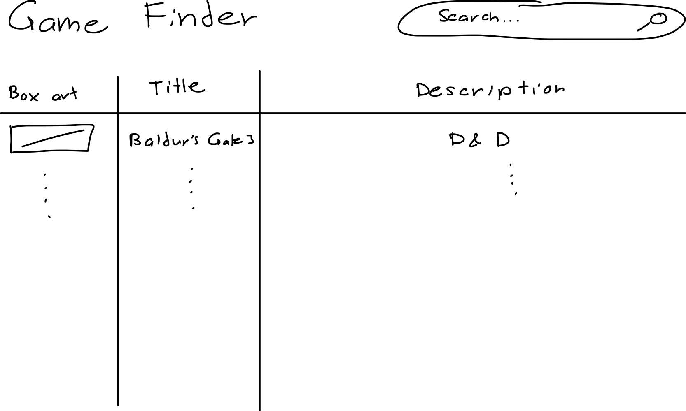
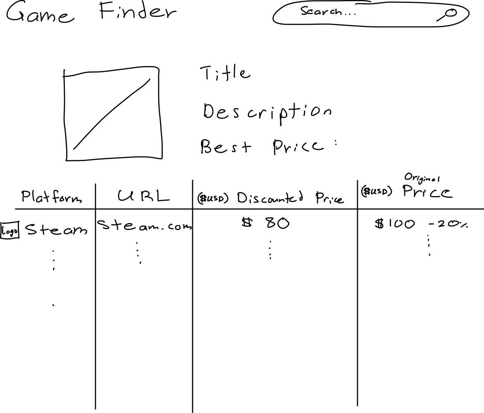
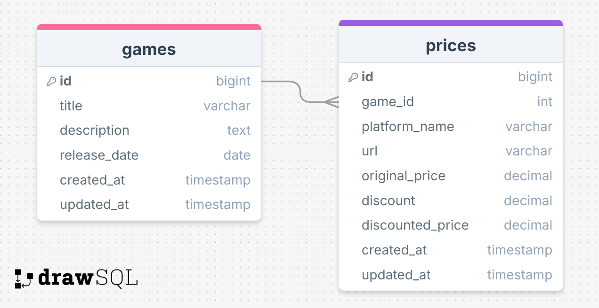

# Project Title

GameDeal Finder

## Overview

###### What is your app? Give a brief description in a couple of sentences.

GameDeal Finder is an application that helps users find the best deals on video games across multiple platforms. Users can search for a specific video game title, view its price on supported platforms, and be directed to the store page to make a purchase. Initially, the app will focus on Steam, with the potential to add other gaming platforms in the future.

### Problem Space

###### Why is your app needed? Give any background information around any pain points or other reasons.

Video game prices can vary significantly between different digital storefronts, and it can be time-consuming for users to check multiple sites to find the best deal. Many gamers end up missing out on sales or discounts because they don't have an easy way to compare prices across platforms. GameDeal Finder solves this problem by providing a simple, user-friendly interface that aggregates video game prices from different platforms, helping users make informed purchasing decisions and saving them money.

### User Profile

###### Who will use your app? How will they use it? Add any special considerations that your app must take into account.

Gamers:

- Looking for the best prices for video games before purchasing.
- Interested in sales, discounts, or price drops for their favorite titles
- Want a simple, fast way to compare prices without visiting multiple sites.

### Features

###### List the functionality that your app will include. These can be written as user stories or descriptions with related details. Do not describe _how_ these features are implemented, only _what_ needs to be implemented.

- As a user, I want to see video games by title and see prices across different platforms.
- As a user, I want to click on a link that takes me directly to the store page where I can purchase the game.
- As a user, I want to see a list of platforms and their current price for a specific game.
- As a user, I want to see the game’s current price, regular price, and any discounts applied (if available).
- As a user, I want the app to display the platform’s logo (e.g., Steam, GOG) alongside the price for easy identification.

## Implementation

### Tech Stack

###### List technologies that will be used in your app, including any libraries to save time or provide more functionality. Be sure to research any potential limitations.

- React
- TypeScript
- MySQL
- Express
- Client libraries:
  - react
  - react-router
  - axios
- Server libraries:
  - knex
  - express
  - bcrypt for password hashing\* [(see Future Implementations) ](#future-implementations)
  -

### APIs

###### List any external sources of data that will be used in your app.

- No external APIs will be used for the first sprint

### Sitemap

- Home page
- Game Detail Page

###### List the pages of your app with brief descriptions. You can show this visually, or write it out.

### Mockups

###### Provide visuals of your app's screens. You can use pictures of hand-drawn sketches, or wireframing tools like Figma.

#### Home page (List Games page)



- Display results with game prices from different platforms (e.g., Steam, GOG).
- Search bar to enter game titles (non-functional for PoC)

#### Game Detail Page



- Show detailed information about the game (e.g., description, release date).
- In a table below, list prices from supported platforms, with links to buy on each platform.
- Optionally show sale discounts and comparisons (within the table)

### Data

###### Describe your data and the relationships between the data points. You can show this visually using diagrams, or write it out.



### Endpoints

###### List endpoints that your server will implement, including HTTP methods, parameters, and example responses.

**GET /games**

- fetch a list of all games, with basic details like title, description, and release date.
- Platform-specific prices not available here, just the general game data

Parameters (future):

- title: Name of the video game

Response:

```
[
    {
        "id": 1,
        "title": "Cyberpunk 2077",
        "description": "A futuristic RPG set in Night City.",
        "release_date": "2020-12-10"
    },
    ...
]
```

**GET /games/:id**

- returns detailed information for a specific game, including its description, release date, and a list of available prices from various platforms.

Parameters:

- id: game id

Response (example: `/games/1`):

```
[
    {
        "id": 1,
        "platform_name": "Steam",
        "original_price": 59.99,
        "discount": 0.2,
        "discounted_price": 47.99,
        "url": "https://store.steampowered.com/app/1091500"
    },
    {
        "id": 2,
        "platform_name": "GOG",
        "original_price": 59.99,
        "discount": 0.1,
        "discounted_price": 53.99,
        "url": "https://www.gog.com/game/cyberpunk_2077"
    },
...
]
```

**GET /games/:id/prices**

- fetches the prices for a specific game from multiple platforms.

Parameters:

- id: game id as number

Response (example: `/games/1/prices`):

```
[
    {
        "id": 1,
        "platform_name": "Steam",
        "original_price": 59.99,
        "discount": 0.2,
        "discounted_price": 47.99,
        "url": "https://store.steampowered.com/app/1091500",
        "created_at": "2024-11-18T10:00:00Z",
        "updated_at": "2024-11-19T14:00:00Z"
    },
    {
        "id": 2,
        "platform_name": "GOG",
        "original_price": 59.99,
        "discount": 0.1,
        "discounted_price": 53.99,
        "url": "https://www.gog.com/game/cyberpunk_2077",
        "created_at": "2024-11-18T10:00:00Z",
        "updated_at": "2024-11-19T14:00:00Z"
    },
...
]
```

ADD HIDDEN ADMIN PAGE

## Roadmap

####### Scope your project as a sprint. Break down the tasks that will need to be completed and map out timeframes for implementation working back from the capstone due date.

- Create client

  - react project with routes and boilerplate pages

- Create server

  - express project with routing, with placeholder 200 responses

- Create migrations

- Gather 10 sample game and price data (10 games, each with at least 1 pricing on 2 platforms)

- Create seeds with sample game data

- Feature: List games on home page

  - Implement list games home page (header includes non-functional search bar)and table with list of games in games database (box art, title, description, price on the Steam platform)
  - Create GET /games endpoint

- Feature: View Game Details - Hero

  - Implement view game details page
  - Create GET /games/:id

- Feature: View Game Details - Table of Prices

  - Implement table of game prices from multiple platforms on the game details page. Table contains platform name, platform logo, URL to buy the game on that specific platform, and price on that platform
  - Create GET /games/:id/prices

- Feature: Hidden Admin Mode - Add/edit Games

  - Allow adding new games or editing existing games.
  - Create add or POST endpoint `/games/add`
  - Create edit or PUT endpoint `/games/:id/edit`
  - Hidden Form page (not meant to be pretty since) that can't be navigated to, but can be accessed by typing in the URL manually

- Feature: Hidden Admin Mode - Add/edit Prices

  - Allow adding new games or editing existing prices.
  - Create add or POST endpoint `/prices/add`
  - Create edit or PUT endpoint `/prices/:id/edit`
  - Hidden Form page (not meant to be pretty since) that can't be navigated to, but can be accessed by typing in the URL manually

- Bug fixes

- DEMO DAY

---

## Future Implementations

###### Your project will be marked based on what you committed to in the above document. Here, you can list any additional features you may complete after the MVP of your application is built, or if you have extra time before the Capstone due date.

- Feature: Search games on home page
  - Make search bar in header functional. Users can type text to filter the table of displayed games (text will search each variable for all rows)
- View price history of games
- Allow users to make an account
- Allow users to favourite games, and view their favourite games
- Allow users to 'watch' games, and get email notified of price drops (when the price is lower than the price at the time of them favouriting the game)
- Allow users to filter search results (ex. exclude prices from a specific platform)
- Only allow admin users to add/edit games and game prices
- Use a webscraper to ensure prices are always up to date (fetched real time)
- Unit and Integration Tests
